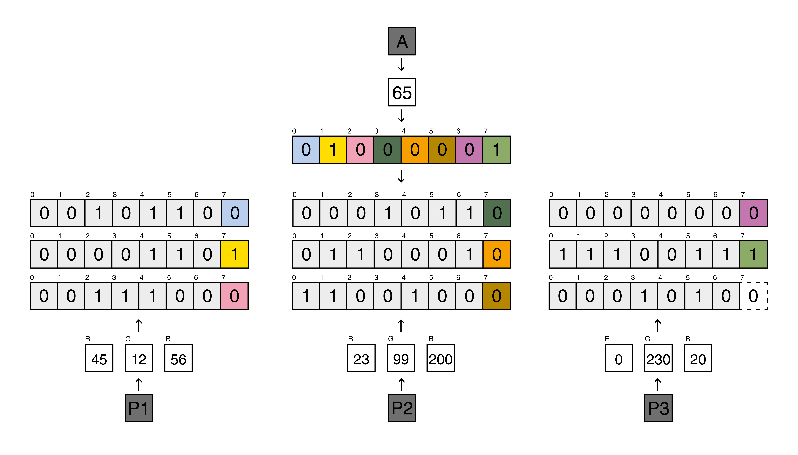

# SteganographyCodes
*Steganography Codes* is a bundle of Processing sketches, which implement the [Steganography](https://en.wikipedia.org/wiki/Steganography) practice. The sketches allows you to hide messages or audio files within an image. 

## How does it work?
*Steganography Codes* works using bits. When converted to bit sequences, data are distributed in the image pixels. One byte (which corresponds to a character or to an audio byte) is hidden in three pixels, thus the change can't be noticed.

Each pixel corresponds to a RGB value. When Red, Green, and Blue values are converted to three bit sequences, each last bit of every sequence is replaced with a bit of the character / audio byte. The last Blue bit of the third pixel highlights if the message / audio file continues (0 = continue, 1 = stop). To reveal a message / audio file, the process has to be done in reverse by getting bits from the pixels to build a message / audio file.

The image down below schematizes the process to hide the character "A" in three pixels (P1, P2, P3).

## Usage
Download and run the sketches in Processing. You can find four sketches to:
- hide a message within an image
- reveal a message from an image
- hide an audio file within an image
- reveal an audio file from an image

Modify the configuration section of each file as you wish. You can choose which image is used to hide data or which image you want to extract the data from.

## Acknowledgement
This project is based on an algorithm illustrated [here](https://medium.com/better-programming/image-steganography-using-python-2250896e48b9).
